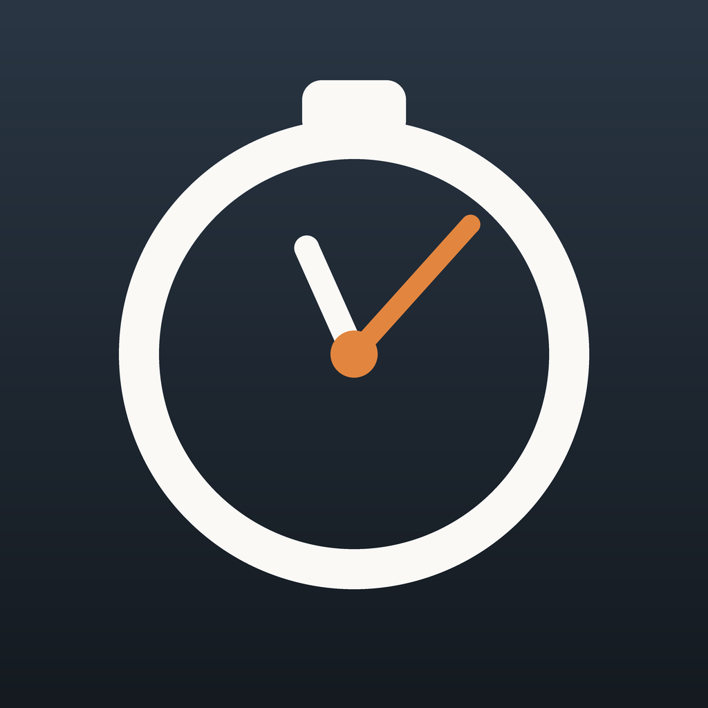
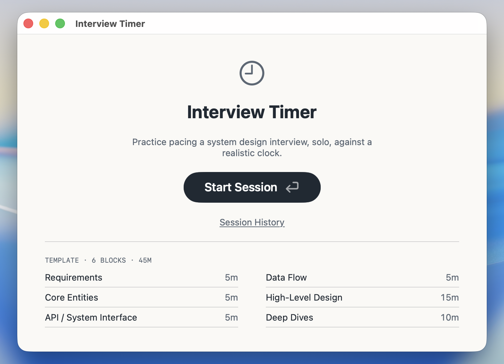
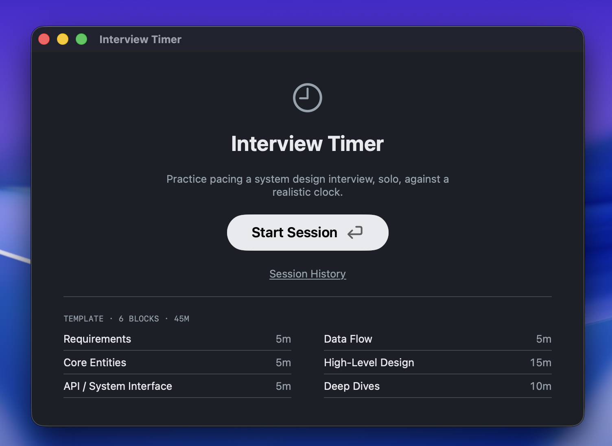
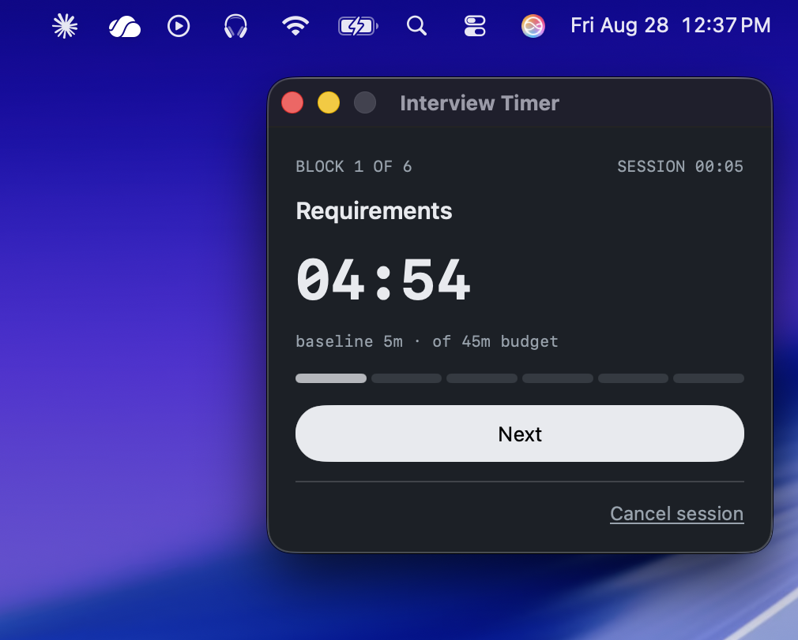
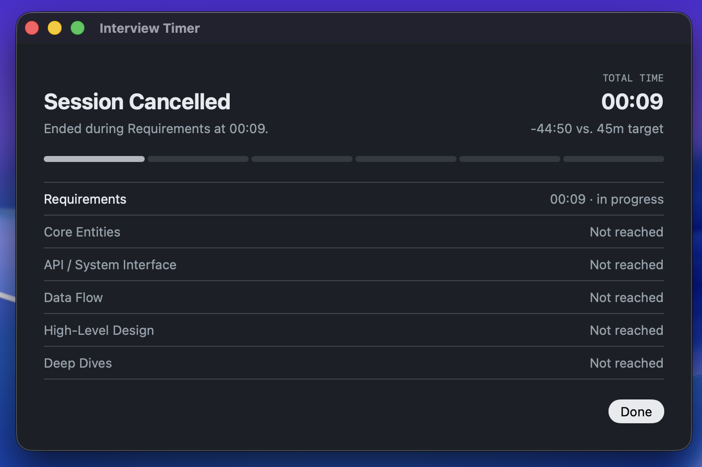
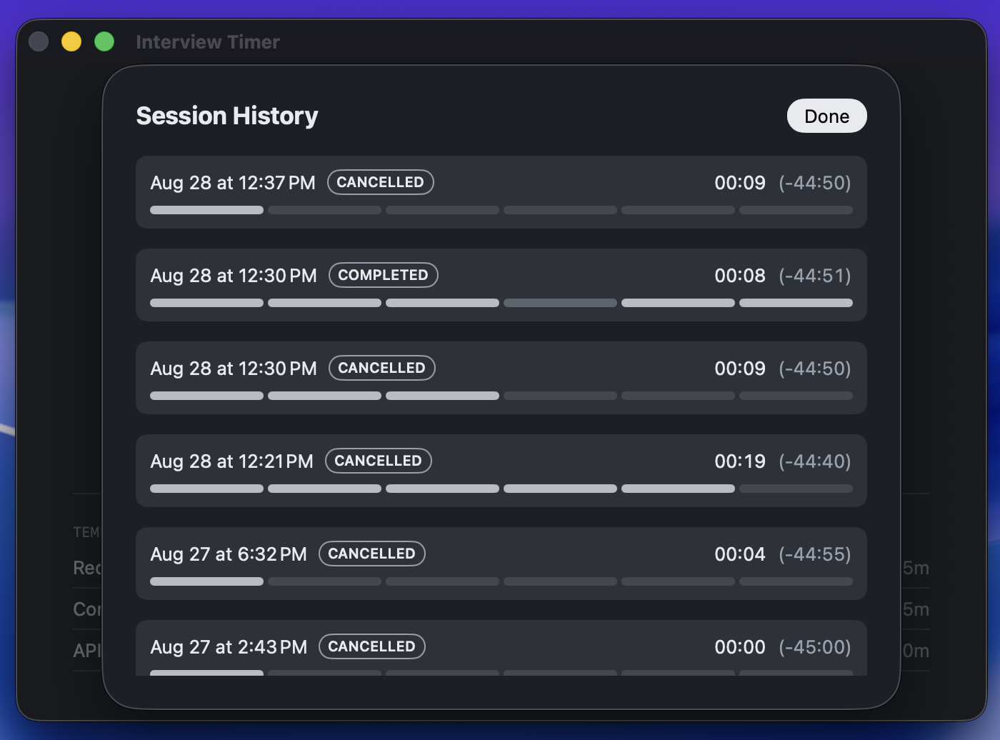

# Interview Timer

[](https://github.com/eebaez/timer-app/actions/workflows/ci.yml)

<p align="center"></p>

A native macOS timer for practicing system design interviews solo —
six timed blocks (Requirements, Core Entities, API/System Interface,
Data Flow, High-Level Design, Deep Dives), 45 minutes total, built to
sit in a corner of your screen while you actually work in a whiteboard
tool elsewhere.


## Screenshots

Home, in light and dark:

<p align="center">
  
  
</p>

An active session — parked in a corner of the screen, out of the way of
whatever whiteboard tool you're actually working in:

<p align="center">
  
</p>

Every session gets a summary, and a full history to review pacing
across attempts:

<p align="center">
  
  
</p>

## Requirements

- macOS 26 (Tahoe) or later
- Xcode 26 / Swift 6.2 toolchain (for building from source)

## Build & run

This is a pure Swift Package Manager project — no Xcode project file.

```bash
swift build          # debug build
swift test            # 29 tests: TimerCore's engine + persistence
swift run TimerMac     # run directly without packaging
```

To produce a real, launchable `.app`:

```bash
./scripts/package-app.sh
```

This builds a release binary and assembles `dist/Interview Timer.app`
(icon, `Info.plist`, ad-hoc code signature), then verifies the
signature. It's signed for local use, not notarized — the first
launch will trigger Gatekeeper's "unidentified developer" warning;
right-click → Open once to get past it. Move it to `/Applications` if
you want it in Launchpad/Spotlight, though it runs fine from wherever
it sits.

## Project layout

```
Sources/
├── TimerCore/    # the engine — models, state machine, persistence. No UI, no platform APIs.
└── TimerMac/     # the macOS app — SwiftUI views, AppModel, window management
Tests/TimerCoreTests/  # 29 tests, one group per Behavioral Contract
scripts/          # packaging (package-app.sh) and icon compilation (build-icns.sh)
docs/             # application behavior, technical design, design artifacts — see below
```

## Documentation

This project keeps two documents deliberately separate, and this
README doesn't duplicate either of them:

- **[docs/application-blueprint.md](docs/application-blueprint.md)**
  — what the app does and why: journeys, rules, behavioral contracts,
  and the decisions behind them, revision-tracked.
- **[docs/technical-plan.md](docs/technical-plan.md)** — how it's
  built: architecture, stack, persistence, the phased build history,
  and a Blueprint Conformance Review confirming the shipped app
  matches what's documented.
- **[docs/artifacts/](docs/artifacts/)** — the high-fidelity designs
  and generated journey-map views referenced by both.

## Status

v1 shipped: all 6 build phases complete, 9/9 Blueprint Behavioral
Contracts conform, packaged as a signed `.app`. A v2/v3 iPhone
companion (sharing `TimerCore`) is planned but not started — see the
Blueprint's Deferred Items.

## License

MIT — see [LICENSE](LICENSE).
